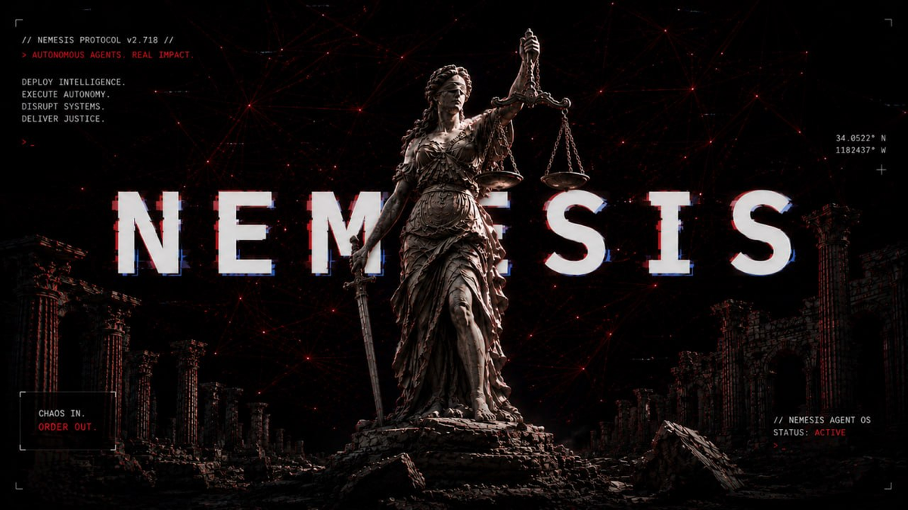

# NEMESIS

NEMESIS is an approval-first agent platform for Base and Solana wallets.
Connect a wallet, describe intent, review a plain-language plan, deploy a
single-condition agent, and receive proposals in the dashboard or Telegram.

Agents monitor. Users approve. Your wallet remains the final signer.

## Live Product

- App: [nemesis-agent.xyz](https://nemesis-agent.xyz)
- Telegram: [@NemesisAgentAppBot](https://t.me/NemesisAgentAppBot)
- X: [@Nemesis_agent](https://x.com/Nemesis_agent)
- GitHub: [nemesis-agent/Nemesis](https://github.com/nemesis-agent/Nemesis)

## What NEMESIS Does

- Deploy approval-first monitoring agents for Base and Solana wallets.
- Turn natural-language intent into template-backed agent plans.
- Deliver proposals through the web dashboard and Telegram.
- Keep every template narrow: one monitored condition, one proposed action.
- Require user review before any transaction leaves the wallet.
- Support Base wallets through RainbowKit, Wagmi, and WalletConnect.
- Support Solana wallet flows including Solflare-compatible connections.
- Use OpenRouter-powered intelligence for planning and product Q&A.

## Why It Exists

Crypto automation often asks users to trust too much. NEMESIS keeps the
automation layer separate from custody and signing. The system can watch,
prepare, and notify, but the user's own wallet must approve the final action.

That model keeps the product useful without turning agents into unchecked
executors.

## User Flow

1. Connect a Base or Solana wallet.
2. Sign in to create a wallet-scoped session.
3. Pick a template or describe intent to NEMESIS.
4. Review the filled approval summary and parameters.
5. Deploy the agent.
6. Link Telegram for proposal alerts.
7. Review, approve, skip, pause, or resume as proposals arrive.

## Template Coverage

NEMESIS ships with 12 production templates:

- Ape agent
- Pool sniper
- Launch flipper
- Limit order agent
- Dip buyer
- Profit taker
- Auto compound
- Gas optimizer
- Airdrop farmer
- Portfolio rebalancer
- Solana dip buyer
- Solana profit taker

High-risk and degen templates require explicit acknowledgement before deploy.

## Security Model

- Non-custodial: NEMESIS never asks for seed phrases or private keys.
- Approval-first: agents create proposals, not forced transactions.
- Wallet-scoped: dashboard, Telegram, agents, and proposals are scoped to the
  authenticated or linked wallet.
- Parameterized: templates use structured parameters and plain-language
  summaries before deployment.
- Guarded: proposal confirmation validates ownership and submitted transaction
  details where executable payloads are available.
- Privacy-minimized: operational data is used only to run sessions, agents,
  Telegram linking, proposals, and product support flows.
- Privacy-polished: wallet labels, logs, model context, link codes, and mutation
  responses are minimized or redacted where practical.

## Stack

- Web: Next.js App Router, React, RainbowKit, Wagmi, SIWE, iron-session.
- Bot: Telegraf.
- Database: Supabase/Postgres through `@nemesis/db`.
- Intelligence: OpenRouter.
- Deploy: Railway monolith with PM2 processes for web and bot.
- Reliability: runner heartbeat, health endpoint, dashboard status, and Base RPC fallback support.

## Documentation

- [Product Guide](./docs/PRODUCT_GUIDE.md)
- [Security Model](./docs/SECURITY.md)
- [Privacy Notes](./docs/PRIVACY.md)
- [Architecture](./ARCHITECTURE.md)
- [Project Context](./CONTEXT.md)

## Release Status

NEMESIS is live in production for approval-first Base and Solana wallet
automation. The current release is focused on template-backed agents, Telegram
proposal alerts, wallet-scoped privacy, and guarded proposal review.
